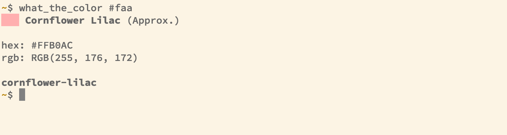

# What the color
Get meaningful names for colors through the terminal. Based on
[name-that-color].



## Getting started
Currently the only way to get `what_the_color` to your environment is get it
through cargo (the package manager bundled with rust) directly from
source (GitHub).

Check your rust version by running `rustc --version` and ensure you have
version `1.45` or higher. If you don't have rust installed, you can install it
via homebrew (`brew install rust`), or [asdf].

With a valid version of rust installed you can install `what_the_color` to your
environment by executing this in your terminal (current path doesn't matter):

```sh
cargo install --root ~/.cargo --git https://github.com/johantell/what_the_color --tag v0.1.0 what_the_color
```

Also, if you haven't already you have to export cargos bin folder into your path
to make `what_the_color` available through your environment (typically put in your `~/.profile`):

```
export PATH="$PATH:$HOME/.cargo/bin"
```

## Usage
`what_the_color` takes a input that can be transformed into a hexadecimal color.
That means that you can copy-paste hex codes easily from your CSS:

```sh
$ what_the_color #faa
```

## Development
Assuming you have cargo (the package manager bundled with rust) installed
you should only have to:

```sh
# Run the test suite
cargo test

# Run the tool
cargo run
```

[name-that-color]: http://chir.ag/projects/name-that-color
[asdf]: http://github.com/asdf/asdf
